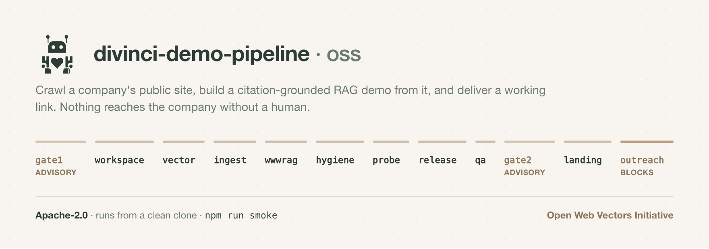
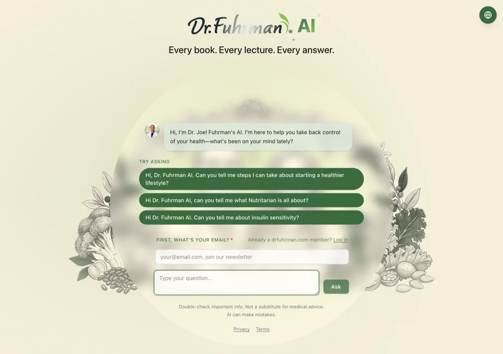
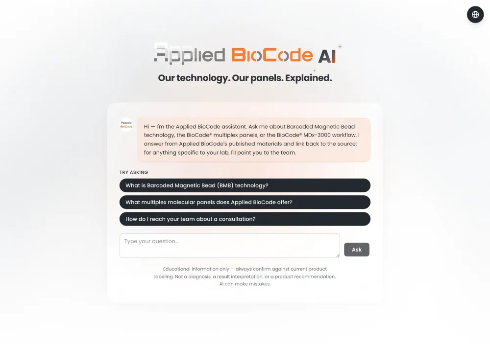
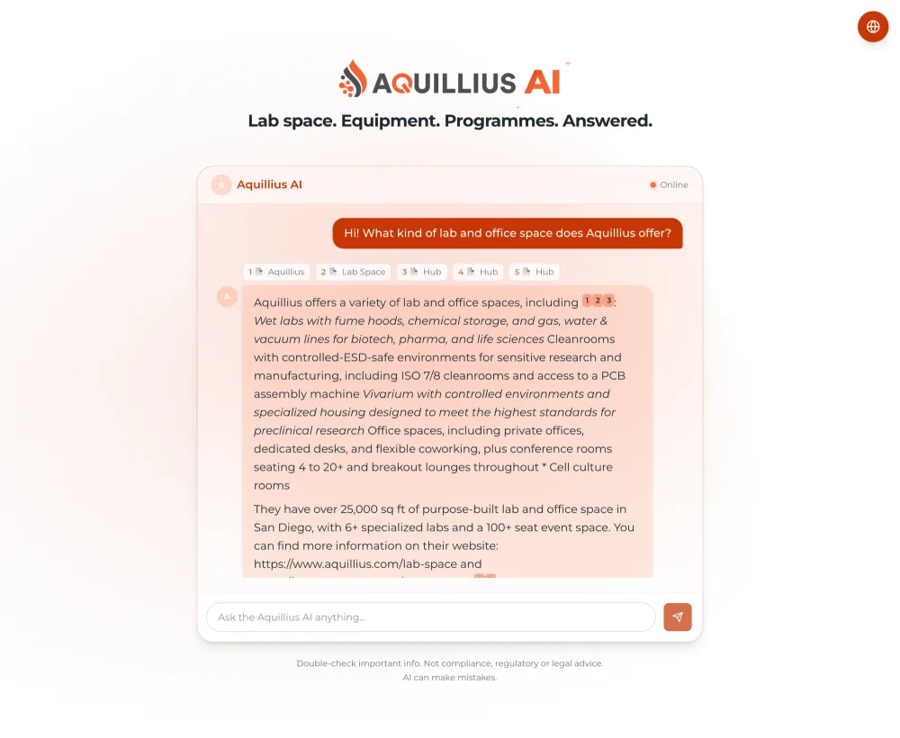

<picture>
  <source media="(prefers-color-scheme: dark)" srcset="docs/header/header-dark.png">
  
</picture>

# Divinci Demo Pipeline

Autonomous adjacent-customer demo pipeline: research companies adjacent to
existing Divinci customers, crawl their public data with the Divinci CLI,
build a white-label RAG (and optionally fine-tuned) model demo from it, and
deliver a working "we built this for you" link — with human gates on corpus
approval and demo review, and hard spend caps via Kill Switch Agent Guard.

## What it produces

Three demos this pipeline built, live right now. Each one is a company's own
public pages, crawled and turned into an assistant that answers **from those
pages and cites them** — the brand, the copy, the starter questions and the
compliance footer are all derived per company, not templated by hand.

| | | |
|:--:|:--:|:--:|
| [](https://drfuhrman.ai/) | [](https://demo-apbiocode-landing.divinci-ai.workers.dev/) | [](https://demo-aquillius-landing.divinci-ai.workers.dev/) |
| **[Dr. Fuhrman AI](https://drfuhrman.ai/)** <br><sub>Every book. Every lecture.</sub> | **[Applied BioCode AI](https://demo-apbiocode-landing.divinci-ai.workers.dev/)** <br><sub>Diagnostics, with a disclaimer the tier requires.</sub> | **[Aquillius AI](https://demo-aquillius-landing.divinci-ai.workers.dev/)** <br><sub>Answers with numbered citations.</sub> |

The middle one is worth a second look: that disclaimer is not decoration. Its
prospect is `clinic-high` in the compliance tier system, so the assistant's
scope, its refusals and that footer are generated from the tier — see
[`policies/`](policies). The right-hand one shows the citation chips every
answer carries back to the source page.

All three are featured with the companies' permission. The pipeline never
contacts anyone on its own — outreach is the one step behind a hard human gate.

Start with [`docs/ARCHITECTURE.md`](docs/ARCHITECTURE.md).

**Running it somewhere other than a laptop?** See
[`docs/TARGETS.md`](docs/TARGETS.md) — the pipeline has five deployment targets
beyond the default, two of them built and tested:

| target | what runs there |
|---|---|
| [**local**](targets/local) | crawl + chunk + embed **on your own machine** with Ollama; only the vectors sync up. Embedding costs nothing and the page text never leaves. |
| [**cloudflare**](targets/cloudflare) | the whole crawl→publish path on the edge — Browser Rendering, Workers AI, Turso, R2 — with no laptop in the loop. ~$0.0007 to crawl a host. |
| [**gcp**](targets/gcp) · [**aws**](targets/aws) | the full orchestrator on a schedule — a Cloud Run Job with state on GCS, or a Fargate task with state on EFS. |
| [vercel](targets/vercel) | hosts a finished demo's landing page (`LANDING_HOST=vercel`) — the pipeline itself does not fit, and the page is not the static site it looks like. |

**Using an AI coding agent?** [`AGENTS.md`](AGENTS.md) carries the rules that
are load-bearing here, and the repo ships agent skills that take an agent from
a clone to a working demo — see [Agent skills](#agent-skills) below.

## Agent skills

Three [Agent Skills](https://docs.claude.com/en/docs/agents-and-tools/agent-skills)
live in `.claude/skills/`, covering the `divinci` CLI work this pipeline does.
Claude Code loads them automatically from a clone; any agent that reads
`SKILL.md` packages can use them, and an agent without skill support can simply
read the three files in this order:

| skill | for |
|---|---|
| [`divinci-demo-pipeline-setup`](.claude/skills/divinci-demo-pipeline-setup/SKILL.md) | fresh clone → verified install: CLI auth, the Cloudflare/GCP resources, the required environment, and the no-network dry run that proves it |
| [`divinci-demo-pipeline-run`](.claude/skills/divinci-demo-pipeline-run/SKILL.md) | running against a real company: the crawl policy, queueing a prospect at the right compliance tier, intake, the human gates, cost, teardown |
| [`divinci-cli-release-demo`](.claude/skills/divinci-cli-release-demo/SKILL.md) | one demo by hand with just the CLI — workspace → RAG vector → crawl → release → publish. The same path the orchestrator automates, which is what makes it the tool for debugging a step that failed inside it |

They are deliberately scoped to *this* pipeline. For building on the Divinci
platform generally — the CLI's full command surface, `@divinci-ai/client`,
`@divinci-ai/server`, `@divinci-ai/mcp`, and the REST API — install the
platform-wide `divinci` skill alongside them:

```sh
curl -sL https://sdk.divinci.ai/divinci-skill.zip -o /tmp/divinci-skill.zip
unzip -q /tmp/divinci-skill.zip -d .claude/skills/   # or ~/.claude/skills/ for every project
```

Full docs: [sdk.divinci.ai](https://sdk.divinci.ai).

⚠️ Agent skills are unrelated to `divinci user-skills` in the CLI, which manages
per-user *platform* skill instances (email and the like). Same word, different
thing.

## What is NOT in this repository

This is an extraction of a pipeline Divinci runs internally, published as its
own repository with no shared history. Three things are deliberately absent,
and the code refers to all of them:

- **`runs/`** — every completed run, one directory per prospect. These hold
  real companies' crawled corpora, generated landing pages and outreach drafts.
  Only `runs/__smoke__/`, a wholly synthetic fixture used by the DRY_RUN
  integration test, is included.
- **`research/prospect-queue.yaml`** — the live prospect queue.
  [`research/prospect-queue.example.yaml`](research/prospect-queue.example.yaml)
  replaces it: same schema, invented entries, and it is what the compliance and
  gate-1 safety tests run against. It is the reference for the queue format.
- **Prospect research and scoring notes**, and one third-party security
  disclosure that is not ours to publish.

So the pipeline runs end-to-end from a clean clone, but starts with an empty
queue — you supply your own prospects.

## Configuration

Anything that names external infrastructure is **required and has no default**.
That is deliberate: a default here does not fail loudly when it is wrong, it
succeeds against somebody else's account. See
[`orchestrator/src/require-env.ts`](orchestrator/src/require-env.ts).

| Variable | What it names |
|---|---|
| `CF_WORKERS_SUBDOMAIN` | your account's `*.workers.dev` subdomain |
| `LANDING_KV_NAMESPACE_ID` | the Cloudflare KV namespace backing each landing worker |
| `DEMO_ASSETS_R2_BUCKET` | the R2 bucket generated demo media is uploaded to |
| `DEMO_ASSETS_R2_BASE` | that bucket's public `https://pub-….r2.dev` base |
| `VERTEX_PROJECT` | the GCP project Vertex AI generation is billed to |

Endpoints that address the **Divinci platform itself** — `DIVINCI_API_URL`,
`DIVINCI_WEB_URL`, `DIVINCI_EMBED_URL` — do default, to the public production
hosts, because those are the same for everyone. Override them to point at a
different environment.

Human gates optionally post to a review board — set `REVIEW_BOARD_URL` and each
gate becomes a task to approve or reject. Leave it unset and the gates work
without one. If your board sits behind Cloudflare Access, supply
`CF_ACCESS_CLIENT_ID` + `CF_ACCESS_CLIENT_SECRET` or `CF_ACCESS_TOKEN`.
See `orchestrator/src/review-board.ts` for the REST shape it expects and what
pointing it at Jira, HubSpot or Attio would involve.

## Authentication

The pipeline targets **production** (`api.divinci.app`) and drives the `divinci`
CLI via its **OAuth session** — `divinci auth login` once.

**The session renews itself.** (This section used to say the token lasts ~a day
and must be re-logged-in; that was wrong.) The CLI's `ensureValidToken`
refreshes whenever under 5 minutes remain, persists the result, and carries a
rotated refresh token forward — so an unattended loop runs indefinitely until
the *refresh* token is revoked. `npm run loop` preflights this with a live
authenticated call before spending anything, and exits 30 when only an
interactive login can fix it.

**Leave `DIVINCI_API_KEY` unset.** Workspace creation is an account-level
operation that only the OAuth session can perform, and the CLI prefers any
`DIVINCI_API_KEY` in the environment over OAuth — so a key (especially a prod
key, which 403s on staging) breaks `divinci workspace create`. Nothing needs a
key any more: the release/RAG-link checks that used to demand one now go through
the CLI on OAuth, and the demo send-readiness check probes the public bootstrap
endpoint unauthenticated. (Those checks previously required the very variable
this paragraph says to leave unset, so they could only ever throw — which is why
QA never ran on 17 of the first 19 runs.)

⚠️ **Runs are pinned to the environment they were built in** (`state.apiUrl`),
and the 17 demos predating 2026-08-05 are staging. The loop skips them while the
session is on production; the preflight refuses a mismatch rather than letting a
run build the workspace in one environment and check for the release in the
other.

Crawl notes: the default scraper `@divinci-ai/fetch-scraper` can't render JS/SPA
pages (and some homepages are bot-protected). Set `crawl.scraper:
"@cloudflare/browser-rendering"` on a manifest source for JS-heavy sites. A
multi-crawl that indexes pages but hits a failed seed is accepted as a partial
corpus rather than aborting the run.

## Feeding crawls into the global WWW RAG corpus (AutoRag groups)

The `wwwrag` pipeline step (after `ingest`) can also push a prospect's crawled
pages into the **global WWW RAG corpus** the Divinci browser extension queries,
so the host becomes one of the AutoRag "groups". It's **opt-in** and **cross-env**:
the demo workspace lives on staging, but the WWW RAG corpus is production, so the
submit targets a separate base with its own prod OAuth bearer.

```sh
# enable + point at prod with a prod OAuth bearer token (NOT an api key —
# submit-url rejects api-key/anon sessions)
WWW_RAG_SUBMIT=1 \
WWW_RAG_API_BASE=https://api.divinci.app \
WWW_RAG_TOKEN="$(... prod OAuth bearer ...)" \
npm run demo -- --prospect acmemarket --run 2026-06-29-001
```

It enumerates the exact page URLs the demo crawl indexed (staging crawl history,
`scrapedPaths`) and `POST`s each to `/api/v1/www-rag/submit-url`, paced under the
10/min rate limit, idempotent (tracked in `state.wwwRagSubmitted`), best-effort
(a www-rag hiccup never fails the run). `submit-url` **re-scrapes** each URL on
the prod side — it does not copy chunks from the staging demo vector.

> **Per-site isolation is now automatic** once the server runs commit
> `c40bad5170` (`ensureWwwRagSiteVector`): submit-url creates a dedicated per-site
> `turso-libsql` vector per host on first contact. **Before that fix is deployed
> to the target env, an unregistered host fans every page into ALL ~20 existing
> groups (corruption)** — so confirm the deploy before feeding.

### Retroactively feeding an already-finished run

The `wwwrag` step only runs in-sequence (before `hygiene`). For runs that already
completed past it (e.g. halted at the outreach gate), use the standalone script —
it enumerates each host's INDEXED page URLs (`rag files`, robust across scrapers)
and submits via the ACTIVE `divinci` OAuth session (no token needed when the
corpus is the same env the CLI points at):

```sh
cd orchestrator
# preview (no writes):
npx tsx scripts/feed-wwwrag.mts --run 2026-06-29-001 --dry-run
# live — ONLY after confirming the target env runs server commit c40bad5170:
npx tsx scripts/feed-wwwrag.mts --run 2026-06-29-001 --confirm-fix-deployed
```

It is paced under the 10/min submit cap, idempotent (per-run
`.wwwrag-submitted.json` ledger), and refuses to submit live without
`--confirm-fix-deployed`.

## Running it as a loop

**See [`docs/LOOP.md`](docs/LOOP.md).** Intake (prospect queue → recon →
manifest) and the tick driver now exist, so the pipeline can run unattended:

```sh
cd orchestrator
npm run loop -- --dry-run          # decide everything, change nothing
npm run intake -- --next           # take the top of research/prospect-queue.yaml
npm run loop                       # one real tick
../launchd/install.sh install      # schedule it (hourly)
```

**What the loop will and will not do on its own.** Gates 1 (corpus) and 2 (demo
review) are **advisory by default**: they run, stamp who approved and when, and
open a board task for the audit trail, but they do not pause. So an unattended
loop *does* crawl queued prospects and spend embedding and model budget with no
human in front of it — bounded by each run's `budgets.crawlPages` and by
`hold: true` on a queue entry. `GATES_BLOCKING=1` restores the pause.

Two things still hold unconditionally, and they are the ones that matter most:

- **Gate 3 blocks.** Nothing reaches a prospect without a human. That is where
  the outward-facing risk lives.
- **Gate 2 refuses an unmeasured run.** A missing QA score fails rather than
  sails past (`ALLOW_UNSCORED_GATE2=1` is the only override). 17 of the first 19
  runs once reached Gate 2 with no score at all and were waved through.

The reasoning behind that trade is written out in full at `gatesAreAdvisory()`
in `orchestrator/src/run-policy.ts`. Read it before scheduling the loop.

## Getting started

```sh
cd orchestrator && npm install
npm test                # 66 files, ~1170 tests, no network
npm run smoke           # every pipeline step, no external calls, no credentials
```

`npm run smoke` exercises every pipeline step against the synthetic fixture
without a single external call, which makes it the fastest way to confirm a
working install before configuring any credentials.

⚠️ **`--run dry` is a run ID, not a mode.** The dry-run switch is the
environment variable `DRY_RUN=1` — `npm run smoke` is exactly
`DRY_RUN=1 npm run demo -- --prospect __smoke__ --run dry`. Until 2026-08-18
this section printed that command *without* `DRY_RUN=1` and called it a dry
run, so following it authenticated against production and performed a real one:
a workspace, a crawl, a published release with anonymous chat open, and model
spend. The pipeline now refuses a live `__smoke__` run outright
(`smokeLiveRefusal` in `orchestrator/src/run-policy.ts`), and a test fails if
any documentation here describes the command without the flag again.

To run it for real, add a prospect to `research/prospect-queue.yaml` (copy the
shape from `prospect-queue.example.yaml`), then:

```sh
npm run intake -- --next     # queue → recon → manifest
npm run loop -- --dry-run    # decide everything, change nothing
npm run loop                 # one real tick
```

## Forking, experimenting, contributing

**Fork it and make it yours.** This was extracted from something Divinci runs on
its own accounts, against its own prospects, under a crawl policy encoding
commitments *we* made — so the prospect queue, the review board, the policy and
the pipeline steps themselves are all meant to be replaced rather than merely
configured. You need no permission and owe no pull request; Apache-2.0 means
what it says. If you get it working for a use we never imagined, we would love
to hear about it.

We do appreciate contributions back — including a bug report that amounts to
"this setup step does not work on my machine", since *can a stranger run this?*
is the test this repo is built around. And the wider project it feeds is the
[**Open Web Vectors Initiative**](https://divinci.ai/open-web-vectors/).

[](https://divinci.ai/open-web-vectors/)

A public, per-site retrieval index where every site gets its own vectors, its
own embeddings and a citation-backed chat endpoint, nothing is trained on, and
any site owner can claim theirs.

[](https://divinci.ai/www-rag/)

Each dot is an indexed site, sized by pages indexed and **positioned near the
sites it resembles** — the layout is the embeddings, not a category tree. Blue
lines are hyperlinks actually found between sites; the fainter web is semantic
similarity. Sites on the outer ring are crawled but not yet embedded, so their
position means nothing yet, and a dashed circle means that site's links have not
been mapped — not that it links nowhere. It is
[live](https://divinci.ai/www-rag/), and it grows by roughly 150 sites a day.

You contribute to it by indexing sites — the opt-in `wwwrag` step above, or by
running [the Cloudflare target](targets/cloudflare) against your own account —
and by improving the crawling. **Pages our scrapers cannot read are the single
biggest limit on coverage**, so a fix there is worth more than a new feature.

> The images above are captured from the live pages; the counts were current at
> the last refresh. [`docs/open-web-vectors/refresh.sh`](docs/open-web-vectors/refresh.sh)
> re-takes them.

Details, and the checks to run before you push, are in
[`CONTRIBUTING.md`](CONTRIBUTING.md).

## Licence

[Apache-2.0](LICENSE). See [NOTICE](NOTICE) — in particular, the licence covers
this code and says nothing about your right to crawl any site you point it at.
