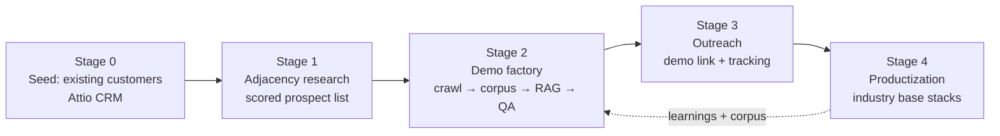

# Divinci Adjacent-Customer Demo Pipeline — Architecture

**Status:** Draft v0.1 (2026-06-10)
**Owner:** Mike Mooring
**Repo:** `divinci-demo-pipeline`

## Thesis

The demo *is* the product. Instead of pitching custom language models in the
abstract, we build a working white-label model from a prospect's own public
data and hand them a link: "we built this for you overnight." Existing
customers are used as **named social proof** (with permission), never as the
demo artifact — adjacent companies are usually competitors, and showing
Customer X's model to X's competitor is a confidentiality landmine.

Long-term, every demo run feeds the real moat: per-industry fine-tuned base
models on vetted corpora, with tested and optimized RAG + inference
architectures that new customers build on top of.

## Pipeline overview



Two human gates sit inside Stage 2 (corpus-manifest approval, demo review).
Everything else is autonomous, budget-capped, and logged.

---

## Stage 0 — Seed

System of record: **Attio** (HubSpot also connected; pick one as canonical —
open question). For each existing customer, capture the attributes adjacency
scoring needs:

- vertical / sub-vertical
- company size & buying motion
- the model we built them (use case, corpus shape, RAG vs fine-tune)
- public referenceability (can we name them? quote results?)

## Stage 1 — Adjacency research

Agentic research fans out from each anchor customer:

1. **Lookalikes** — same vertical, similar size/workflow.
2. **Neighbor verticals** — same data shape, different industry (e.g. a
   product-catalog RAG generalizes from one retail niche to the next).

**Scoring rubric** (each 0–5, weighted):

| Signal | Why it matters |
| --- | --- |
| Vertical match to an anchor customer | The relatable story: "we built this for a company like yours" |
| Public-data richness (site depth, docs, KB, catalogs, filings) | Predicts demo quality before we spend a crawl |
| Buying signals (hiring AI roles, AI mentions, funding, tech stack) | Timing |
| Size / deal fit | Qualifies the effort of a fine-tune-track demo |

**Output:** prospect records written back to the CRM with adjacency score,
anchor-customer reference, and the candidate source list the researcher found.
Stage 2 consumes the CRM queue, not ad-hoc lists.

## Stage 2 — Demo factory (per prospect)

State machine, one run per prospect, all steps via `divinci` CLI with
`--json` for scripting. Workspace naming convention: `demo-<prospect-slug>`.

```
research → MANIFEST GATE → create → ingest (incl. prospect-site crawl) →
  tune → qa → [optional fine-tune track] → DEMO REVIEW GATE → release → outreach
```

> v0 orchestrator (`orchestrator/`) implements this with **all spend behind
> Gate 1** — workspace creation and the prospect-site crawl only happen after
> a human approves the manifest. A `ks guard status` check runs before every
> spend step. Gates pause the run (exit 0 with instructions); re-running the
> same command resumes from persisted state in `runs/<prospect>/<run>/state.json`.

1. **Create** — `divinci workspace create` (white-label workspace; demo
   branding config).
2. **Crawl** — `divinci rag crawl <url>` on the prospect's site, under the
   crawl policy (see `policies/crawl-policy.md`): robots.txt honored, rate
   limited, hard page budget, exclusion list (login areas, third-party
   embeds, user-generated content).
3. **Agentic source research** — find every other source that belongs in the
   corpus: docs sites, support KBs, product catalogs, public filings, press,
   published whitepapers. Each candidate is vetted for provenance, license,
   freshness, and relevance, then proposed in a **corpus manifest** (schema
   below) with a destination: `rag`, `fine-tune`, or `reject`.
4. **⛔ Gate 1: manifest approval (human).** Nothing is ingested until a
   human approves the manifest. This is the cheap checkpoint that prevents
   the pipeline from embedding wrong pricing, a lawsuit page, or a
   competitor comparison into a demo we send back to the company we crawled.
5. **Ingest** — crawl/upload each approved source into the workspace's RAG
   vector(s); then hygiene passes: `rag dedupe`, `rag dedupe-files`,
   `rag scan-artifacts`, `rag health`.
6. **Retrieval tuning** — `rag config` per vector; generate eval queries
   (`rag products` for catalog-shaped corpora) and probe with
   `rag test-retrieval` until retrieval scores clear threshold.
7. **QA** — `divinci qa` suite against the demo's expected behaviors, plus a
   `divinci trust` attested eval run. The signed TrustBench log doubles as a
   sales artifact ("here's the attested eval of your model").
8. **Optional fine-tune track** — only for high-score prospects and only
   when the approved manifest flags sources `fine-tune`:
   `divinci training-data` → `divinci fine-tune`. This is the expensive
   path; it always requires explicit per-run approval (cost gate, not just
   quality gate).
9. **⛔ Gate 2: demo review (human).** A person plays with the demo before
   the prospect does.
10. **Release** — `divinci release` + arena preset; produce the demo URL
    with an expiry.

### Corpus manifest schema

```json
{
  "prospect": "acme-dental",
  "anchorCustomer": "crm:record-id",
  "run": "2026-06-10-001",
  "sources": [
    {
      "url": "https://acme.example/docs",
      "type": "docs-site",
      "destination": "rag",
      "rationale": "Product documentation; core Q&A corpus",
      "license": "public web, robots-allowed",
      "freshness": "2026-05",
      "estPages": 140
    }
  ],
  "budgets": { "crawlPages": 500, "embeddingTokens": 2000000 },
  "approvedBy": null,
  "approvedAt": null
}
```

Manifests and run logs are committed under `runs/` — the audit trail of what
we showed whom, built from what.

## Stage 3 — Outreach

- Demo link with expiry + usage tracking; engagement events flow back to the
  CRM record (opened, queries asked, which topics).
- Outreach references the *anchor story* ("we build custom models for
  <vertical>; here's one speaking your business already") — never the anchor
  customer's actual model or data.
- Demo workspaces are torn down on expiry (`workspace delete`) or converted
  on close — caps standing inference spend and creates honest urgency.

## Stage 4 — Industry base stacks (productization)

Each vertical that accumulates several successful demos graduates into a
**domain stack**: a vetted, licensed corpus + tuned retrieval architecture +
(eventually) a fine-tuned base model customers build on. Mechanics already
exist: `workspace clone` (re-embed with `--embedding-model`) +
`release clone --to-workspace` promote a proven demo configuration into a
template workspace. Selection criteria, corpus licensing for reuse, and eval
baselines per domain are specced separately when the first vertical
qualifies.

**Shared domain vectors via `rag groups`.** T2 sources should not be
re-crawled and re-embedded into every prospect workspace. Instead, each
industry domain gets one shared, versioned T2 vector (e.g.
`domain-spine-ortho`), and each demo composes a RAG **group**: the
prospect's T1 vector + the shared domain vector, merged at retrieval
(`divinci rag groups`). Demos get instantly richer as the domain corpus
grows, the domain vector *is* the Stage 4 asset accruing run over run, and
per-demo cost drops to crawling T1 only. (v0/maiden run embeds T2 into the
prospect vector directly; switch to groups from run 2.)

---

## Cost & safety controls

This pipeline is the canonical runaway-spend shape: autonomous crawl → embed
→ fine-tune → standing inference demos, fanned out over a prospect list. So:

- **Agent Guard / `ks guard`** budgets wrap every pipeline run (per-session
  and daily-rolling caps); Kill Switch monitors the pipeline's infra.
  Dogfooding this is itself a marketing story.
- Hard per-run budgets live in the manifest (`crawlPages`,
  `embeddingTokens`); the orchestrator enforces them, not the agent.
- Fine-tune jobs never start without explicit human approval.
- Demo workspaces expire; no zombie inference.

## Corpus tiers & confidentiality policy

Every source in a manifest belongs to exactly one tier:

| Tier | Examples | Usable in |
| --- | --- | --- |
| **T1 — Prospect's own public data** | Their site, docs, KB, catalogs, filings | That prospect's demo only |
| **T2 — Vetted general/domain knowledge** | Scientific papers, open datasets, standards, public-domain references for the industry | Any demo or domain stack (license permitting) — this tier is the foundation of the Stage 4 industry base models |
| **T3 — Customer data** | Anything from an existing customer engagement | Never. Not in demos, not in domain stacks |

- Customer-built models are never shown to prospects, adjacent or otherwise.
- Named social proof and quoted results require recorded customer
  permission (tracked on the CRM record).
- Demos are built exclusively from T1 + T2 sources listed in the approved
  manifest; T2 sources carry a license field and are reusable across runs,
  so each demo also grows the shared domain corpus.

## Orchestration & repo layout

Orchestrator: a small TypeScript runner that drives the `divinci` CLI
(`--json --quiet`) as its execution layer, holds the per-prospect state
machine, enforces budgets, and pauses at gates. Research steps are agent
calls; everything else is deterministic CLI invocation.

```
divinci-demo-pipeline/
  AGENTS.md                 # rules for AI coding agents working here
  .claude/skills/           # setup / run / CLI skills for Claude Code
  docs/ARCHITECTURE.md      # this file
  policies/crawl-policy.md  # the rules every crawl runs under
  orchestrator/             # state machine + CLI driver (TS)
  research/                 # prospect-queue.example.yaml (the live queue is
                            #   yours to create and is gitignored)
  runs/                     # per-prospect manifests + logs (audit trail).
                            #   GITIGNORED — real companies' corpora and the
                            #   outreach written about them. Only the
                            #   synthetic __smoke__ fixture is tracked.
```

## Open questions

1. Attio vs HubSpot as the canonical system of record (both are connected).
2. Demo hosting/branding pattern — subdomain per prospect
   (`acme.demos.divinci.ai`?) vs path-based.
3. Who staffs the two human gates day-to-day, and target turnaround.
4. Target cost-per-demo (sets the crawl/embedding budget defaults and the
   bar for the fine-tune track).
5. Demo expiry window (7 days? 14?) and what "converted" hand-off looks
   like.
